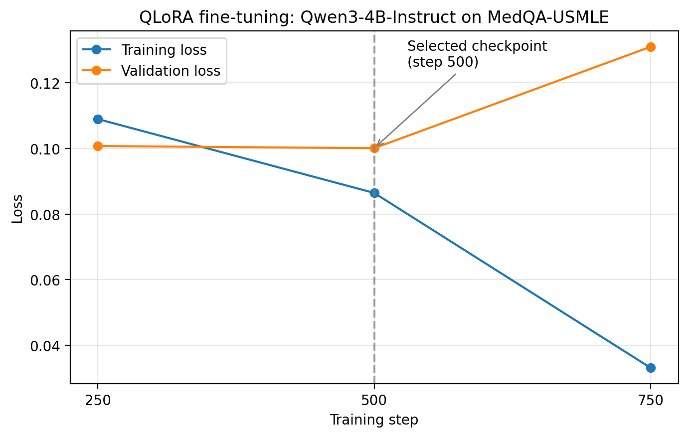

# Medical LLM Fine-Tuning: QLoRA on Qwen3-4B-Instruct for MedQA (USMLE)

This project fine-tunes `Qwen/Qwen3-4B-Instruct-2507` using QLoRA.

The goal is to make the model better at answering USMLE-style multiple-choice medical questions.

The model was trained on a single free NVIDIA T4 GPU on Kaggle.

## Results

The model was evaluated on 500 questions from the MedQA test set.

The same questions and prompt were used for both the base model and the fine-tuned model.

| Metric               | Base model | Fine-tuned | Change |
| -------------------- | ---------: | ---------: | -----: |
| Accuracy             |      0.490 |      0.614 | +0.124 |
| Macro F1             |      0.487 |      0.614 | +0.126 |
| Invalid answer rate  |      0.000 |      0.000 |  0.000 |
| Format mismatch rate |      0.020 |      0.002 | -0.018 |
| Hallucination rate   |      0.020 |      0.002 | -0.018 |

Per-class F1 scores:

| Class | Base model | Fine-tuned |
| ----- | ---------: | ---------: |
| A     |      0.408 |      0.596 |
| B     |      0.535 |      0.648 |
| C     |      0.500 |      0.630 |
| D     |      0.505 |      0.580 |

The evaluation used 500 questions, so the accuracy has a margin of error of roughly ±4 percentage points.

The fine-tuned model improved accuracy by about 12 percentage points. Some of this improvement may come from the model learning the expected answer format, such as `C) <option text>`, and not only from improved medical knowledge.

An earlier test with 100 questions gave an accuracy of 42% for the base model and 59% for the fine-tuned model.

The 500-question evaluation is reported here because it gives a more reliable result.

## Training Curve



The original training plan was 3 epochs.

Training was stopped at around step 800.

The validation loss was lowest between steps 250 and 500. It was 0.1007 at step 250 and 0.1001 at step 500.

After that, the validation loss started increasing. It reached 0.131 at step 750 while the training loss continued to decrease.

This suggested that the model was starting to overfit.

Because of this, the checkpoint from step 500 was selected as the final model.

## Setup

| Item                      | Value                              |
| ------------------------- | ---------------------------------- |
| Base model                | `Qwen/Qwen3-4B-Instruct-2507`      |
| Dataset                   | `GBaker/MedQA-USMLE-4-options-hf`  |
| Fine-tuning method        | QLoRA                              |
| Quantization              | 4-bit NF4 with double quantization |
| Compute type              | FP16                               |
| LoRA rank                 | 16                                 |
| LoRA alpha                | 32                                 |
| LoRA dropout              | 0.05                               |
| LoRA target modules       | q/k/v/o/gate/up/down projections   |
| Trainable parameters      | About 33M                          |
| Trainable parameter ratio | About 0.81%                        |
| Batch size                | 4 per device                       |
| Gradient accumulation     | 4                                  |
| Effective batch size      | 16                                 |
| Learning rate             | 2e-4                               |
| Scheduler                 | Cosine with warmup                 |
| Optimizer                 | `paged_adamw_8bit`                 |
| Maximum sequence length   | 512 tokens                         |
| Loss                      | Completion-only                    |
| Hardware                  | 1x NVIDIA T4 on Kaggle             |

Examples longer than 512 tokens were filtered out.

Only the answer part of each example was used for the training loss.

The model uses a system prompt that tells it to act as a medical expert answering USMLE-style multiple-choice questions.

The expected answer format is:

```text
C) <option text>
```

## Notes on the Implementation


### Checkpoint Selection

The checkpoints were compared using validation loss.

The checkpoint at step 500 had the lowest validation loss, so it was selected as the final model.

Later checkpoints were not used.

### Evaluation

The final evaluation loads the step 500 LoRA adapter onto a freshly loaded base model.

The base model and fine-tuned model were evaluated on exactly the same questions.

The question indices are stored in:

```text
reports/eval_indices.json
```

## Reproducing the Results

The trained adapter is about 130 MB and is not included in this repository because of GitHub's file size limit.

To reproduce the results:

1. Open `medical-llm-fine-tuning.ipynb` in Kaggle.
2. Enable a T4 GPU.
3. Set `SMOKE_TEST = False` in the configuration cell.
4. Run the notebook from the beginning.
5. Use the step 500 checkpoint for the final model.

Training takes several hours on a T4 GPU.

To load a saved adapter onto the base model:

```python
import torch

from transformers import (
    AutoTokenizer,
    AutoModelForCausalLM,
    BitsAndBytesConfig,
)
from peft import PeftModel


BASE = "Qwen/Qwen3-4B-Instruct-2507"

ADAPTER = "path/to/adapter"
# Folder containing adapter_model.safetensors
# and adapter_config.json


bnb = BitsAndBytesConfig(
    load_in_4bit=True,
    bnb_4bit_quant_type="nf4",
    bnb_4bit_compute_dtype=torch.float16,
    bnb_4bit_use_double_quant=True,
)


tokenizer = AutoTokenizer.from_pretrained(BASE)

model = AutoModelForCausalLM.from_pretrained(
    BASE,
    quantization_config=bnb,
    device_map={"": 0},
)

model = PeftModel.from_pretrained(
    model,
    ADAPTER,
)

model.eval()
```

## Repository Contents

```text
.
├── medical-llm-fine-tuning.ipynb
├── reports/
│   ├── baseline.json
│   ├── finetuned.json
│   ├── comparison.json
│   └── eval_indices.json
├── loss_curve.png
└── README.md
```

The notebook contains the main project workflow, including data preparation, baseline evaluation, fine-tuning, and final evaluation.

The `reports` folder contains the evaluation results.

`eval_indices.json` contains the exact test questions used for evaluation.

`loss_curve.png` shows the training and validation loss.

## Limitations

* The evaluation uses 500 questions from one test run, so the accuracy has a margin of error of roughly ±4 percentage points.
* A good score on a multiple-choice benchmark does not mean that the model is safe or reliable for real clinical use.
* Only one prompt format was tested.
* Other fine-tuning configurations were not compared.
* Only the training and validation logs up to step 750 were kept, so the loss curve contains only a small number of points.
* The trained adapter is not included in the repository. The results can therefore be verified by running the notebook again.

## Acknowledgements

* Base model: [Qwen3-4B-Instruct-2507](https://huggingface.co/Qwen/Qwen3-4B-Instruct-2507)
* Dataset: [GBaker/MedQA-USMLE-4-options-hf](https://huggingface.co/datasets/GBaker/MedQA-USMLE-4-options-hf)
* Dataset based on MedQA by Jin et al. (2020).

---